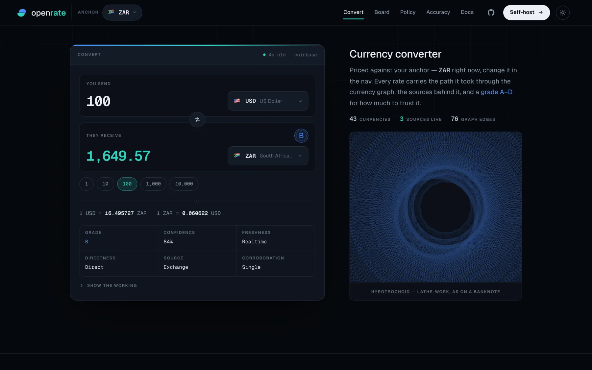
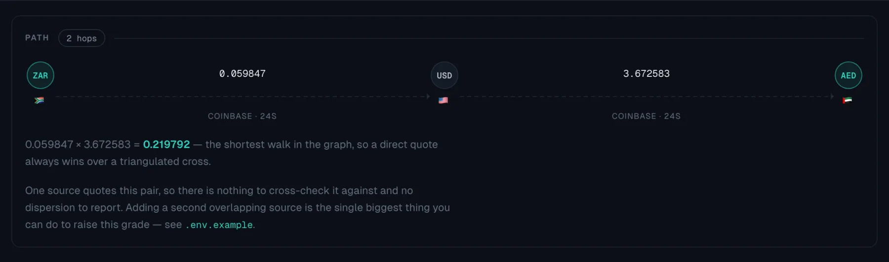
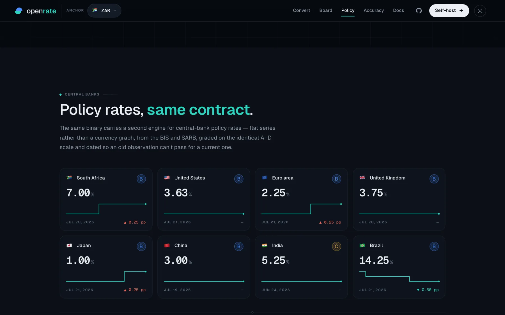

<p align="center">
  
</p>

<h1 align="center">openrate</h1>

<p align="center">Open, ZAR-anchored exchange rates — the open way.</p>

<p align="center">
  <a href="docs/">Docs</a> ·
  <a href="docs/api.md">API</a> ·
  <a href="docs/configuration.md">Configuration</a> ·
  <a href="docs/library.md">Go library</a> ·
  <a href="docs/graph-model.md">Graph model</a> ·
  <a href="ACCURACY.md">Accuracy</a> ·
  <a href="CHANGELOG.md">Changelog</a> ·
  <a href="ROADMAP.md">Roadmap</a>
</p>

<p align="center">
  <sub>Current release: <a href="https://github.com/vul-os/openrate/releases/tag/v0.2.0">v0.2.0</a></sub>
</p>

<p align="center">
  <a href="LICENSE-MIT"></a>
  <a href="https://golang.org"></a>
</p>

---

**openrate** is an open-source exchange-rate engine. It ingests rates "the open
way" — from central-bank reference files and free public venue feeds, not by
reselling a paid API — models every currency as a **graph** rather than picking a
single canonical base, and serves an all-pairs JSON API plus an embedded React
UI from a single Go binary.

<p align="center">
  
</p>

Most rate APIs hand you a number and ask you to trust it. openrate hands you the
walk it took through the currency graph, the individual source quotes behind
every hop, how far apart those sources are, and a grade for the lot:

<p align="center">
  
</p>

<p align="center">
  <sub>Every screenshot here is a real capture of the running engine, produced by
  <code>npm --prefix web run shots</code>. More on the
  <a href="https://openrate.dev/">site</a>.</sub>
</p>

## Why a graph, not a base

Most rate APIs pick one base currency (usually EUR/USD) and derive everything
through it. openrate keeps each source's quotes in their **native base** (ECB in
EUR, SARB in ZAR, …) as edges in a currency graph. Any pair is the product of
rates along the shortest path between them, so:

- **ZAR is the anchor for free** — it's just the default presentation base, a
  view over the same graph (`?base=ZAR`, or any other).
- **Directly quoted pairs win** — BFS reaches a pair by the fewest hops first, so
  a direct quote always beats a triangulated cross.
- **No single point of contamination** — a bad edge only affects paths through
  it, not every pair.
- **Provenance on every number** — each rate carries `hops`, `as_of`, and `age`,
  so consumers see exactly how stale it is (it matters: fiat is frozen on
  weekends).

## Run

```bash
go run ./cmd/openrate            # serves :8080, base ZAR, hourly refresh
# or
go build -o openrate ./cmd/openrate && ./openrate -addr :8080 -base ZAR -refresh 1h
```

Config via flags or env: `OPENRATE_ADDR`, `OPENRATE_BASE`, `OPENRATE_REFRESH`,
`OPENRATE_SOURCES`, `OPENRATE_RATELIMIT`. Full reference:
[docs/configuration.md](docs/configuration.md).

With Docker:

```bash
docker build -t openrate . && docker run -p 8080:8080 openrate
```

### Verify a release before you run it

Releases publish a source archive plus a `SHA256SUMS` manifest covering every
published asset, and a sigstore build-provenance attestation minted from the
release workflow's OIDC identity (no long-lived signing key exists, so there is
none to leak or rotate). `scripts/verify.sh` is what you run against them:

```bash
curl -fsSLO https://raw.githubusercontent.com/vul-os/openrate/v0.2.0/scripts/verify.sh
bash verify.sh --tag v0.2.0 --attest openrate_0.2.0_source.zip
```

It fetches the manifest, looks up the **exact** entry for the asset (names are
matched as strings, not as regexes) and compares digests. It has two outcomes:
verified, or non-zero with a diagnostic naming what was wrong — a missing or
malformed manifest, a missing entry, a truncated download, a digest mismatch, an
HTML error page served where bytes were expected. There is no `--skip-verify`,
and a `SHA256SUMS` that 404s is a **failure**, never "nothing to check".
`--attest` additionally verifies the provenance (needs the `gh` CLI); leave it
off and the script says out loud that provenance was *not* checked, so a pass
never implies more than it checked.

`bash scripts/verify.sh --selftest` runs 24 synthetic-origin cases asserting
that each refusal still fires; CI runs it on every push.

## Embed as a Go library

Instead of running the binary, import the root package and run the engine
in-process — no subprocess, same store/sources/API/hardening as `cmd/openrate`:

```go
import "github.com/vul-os/openrate"

local, err := openrate.Start(openrate.Options{}) // ZAR base, hourly refresh, ephemeral port
if err != nil {
	log.Fatal(err)
}
defer local.Close()

resp, _ := http.Get(local.APIBaseURL() + "/rates") // or local.BaseURL + "/healthz"
```

`Options` mirrors the binary's flags (`Addr`, `Base`, `Refresh`, `Sources`,
`RateLimit`, `ServeUI`). `Start` returns once `/healthz` is serving. The engine's
building blocks stay under `internal/`; this package is the supported public API.

## Deployment modes

openrate ships as sovereign, self-contained infrastructure — run it two ways,
both fully open, keyless, and free:

| Shape | How |
|---|---|
| **Self-hosted binary** | `go run ./cmd/openrate` — keyless, all sources, hourly refresh |
| **Embedded Go library** | `openrate.Start(...)` in-process — the same engine, no subprocess |

## API

| Endpoint | Description |
|---|---|
| `GET /api/v1/rates?base=ZAR` | All currencies vs base; `rate` reads "1 base = rate CCY" |
| `GET /api/v1/convert?from=USD&to=ZAR&amount=100` | Convert, with rate provenance |
| `GET /api/v1/meta` | Sources, freshness, currency list |
| `GET /healthz` | Liveness |

Every rate includes `hops`, `as_of`, `age_sec`, the `path` and `sources`, plus a
**`quality`** block (grade A–D + confidence) — see below. Full request/response
shapes: [docs/api.md](docs/api.md).

### Interest rates (optional engine)

A separate, flat time-series engine (no currency graph) for central-bank policy
and reference rates worldwide. Enable with `-interest-sources` (binary) or
`Options{Interest: true}` (library). Served alongside the FX API:

| Endpoint | Description |
|---|---|
| `GET /api/v1/interest/rates?area=US&type=policy` | Latest value per series + confidence grade |
| `GET /api/v1/interest/series?id=us.policy` | One series with full history (timeseries) |
| `GET /api/v1/interest/meta` | Areas covered, series catalogue, source status |

Out of the box (`bis,sarbrates`, no keys) this covers **48 central banks' policy
rates with daily history** plus the South African ZARONIA family; set
`OPENRATE_FRED_API_KEY` to auto-enable US benchmark series. Each series carries an
interest-tuned `quality` grade. See [docs/interest-rates.md](docs/interest-rates.md).

## Accuracy

Every price carries a `quality` assessment so you know how much to trust it:

```json
"quality": {
  "grade": "B", "confidence": 0.89,
  "freshness": "realtime", "directness": "direct", "source_class": "exchange",
  "corroboration": { "sources": 4, "spread_bps": 29, "agree": true }
}
```

The grade combines **freshness** (edge age), **directness** (hop count),
**source authority** (official > exchange > aggregator > unofficial),
**cross-source agreement** (spread in bps), and per-currency **caveats**
(e.g. NGN/EGP/CNY official-vs-parallel-rate flags). Full model:
[ACCURACY.md](ACCURACY.md). The web UI shows the grade in the converter and a
dedicated **Accuracy** page documenting the methodology.

## Sources

Selectable with `-sources` (or `OPENRATE_SOURCES`). Default: `ecb,coinbase,luno,sarb`.

| Source | Default | Cadence | Notes |
|---|---|---|---|
| **ECB** daily file | ✅ | daily | EUR-base, ~30 currencies, ~16:00 CET |
| **Coinbase** | ✅ | real-time | free/no-auth fiat (incl. **ZAR**) + crypto — best open intraday source |
| **Luno** | ✅ | real-time | SA exchange, live BTC/ETH/USDT vs ZAR; bridges to fiat via BTC |
| **SARB** | ✅ | daily | **authoritative ZAR** (per USD/GBP/EUR/JPY); slow host → bounded dialer + retries |
| **Frankfurter** | opt-in | daily | clean JSON ECB mirror |
| **open.er-api** | opt-in | daily incl. **weekends** | fills the ECB Fri→Mon gap |
| **fawazahmed0** | opt-in | daily | ~400 currencies, dual-CDN, no limits |
| **Bank of Canada** | opt-in | daily | Valet REST, independent cross-check |
| **Yahoo Finance** | opt-in | ~1 min | unofficial, **ToS-prohibited**, rate-limited — last resort |

Four further sources are **key-gated** and auto-enable when their API key is
present: Open Exchange Rates, Twelve Data, Polygon.io and TraderMade. They are
not open data, so they are off unless you bring a key — see
[`.env.example`](.env.example) and [SOURCES.md](SOURCES.md).

Because the graph prefers the freshest direct edge, `USD→ZAR` resolves to the
live Coinbase quote (~seconds old) while `EUR/GBP/JPY→ZAR` resolve to SARB's
authoritative direct quotes — each chosen automatically, no special-casing.
Add a source by implementing `sources.Source` and registering it in
`internal/sources/registry.go`. Full catalog + freshness notes: [SOURCES.md](SOURCES.md).

## Web UI

The interface is embedded in the binary — the converter, a sortable board of
every pair with its grade, the policy-rate section, and the accuracy
methodology, in an ink theme and a banknote-paper one.

```bash
npm --prefix web install
npm --prefix web run dev      # Vite dev server, proxies /api to :8080
npm --prefix web run build    # regenerates web/dist, embedded into the binary
npm --prefix web test         # boots the BUILT bundle in chromium (Playwright)
npm --prefix web run shots    # recaptures site/assets/shots from a running engine
```

`run shots` needs an openrate on `:8412` (override with `OPENRATE_URL`) and
`cwebp` on `PATH`. Every image on the README and the site comes out of it, so
they can never drift from what the app actually looks like.

<p align="center">
  
</p>

## Layout

```
openrate.go       public package: embed the engine in-process (Start/Close)
cmd/openrate      entrypoint: wires sources -> store -> api + UI
internal/graph    currency graph, BFS all-pairs materialization
internal/sources  pluggable FX sources (ecb, coinbase, luno, sarb, … all live)
internal/store    ingest loop + snapshot store
internal/quality  the grade/confidence model attached to every rate
internal/api      JSON read endpoints
internal/ratesapi policy-rate endpoints, /api/v1/interest/*
web               Vite + React JSX UI (embedded via go:embed)
web/scripts       shots.mjs — captures site/assets/shots from a running engine
site              the static site: landing, docs viewer, generated site/docs
site/gen          regenerates site/docs from the canonical docs (CI-gated)
```

## Documentation

Full documentation lives in **[`docs/`](docs/)**.

| Guide | What's inside |
|---|---|
| [API reference](docs/api.md) | Every endpoint, params, and full response shapes |
| [Configuration](docs/configuration.md) | Flags, env vars, and the source spec |
| [Go library](docs/library.md) | Embed the engine in-process with `Start`/`Close` |
| [Graph model](docs/graph-model.md) | Why currencies are a graph, not a base |
| [Accuracy & quality](ACCURACY.md) | The grade/confidence model behind every rate |
| [Sources](SOURCES.md) | Full source catalog, cadence, and provenance |
| [Web UI](docs/web-ui.md) | The embedded React dashboard |

## License

[MIT](LICENSE-MIT) OR [Apache-2.0](LICENSE-APACHE) — © VulOS. openrate is a VulOS
project; source and issues at [github.com/vul-os/openrate](https://github.com/vul-os/openrate).

### Third-party notices

openrate redistributes third-party software: the Go standard library and any Go
modules compiled into the binary, the npm packages bundled into the embedded
React UI (including the **Instrument Serif**, **Archivo** and **JetBrains Mono**
webfonts, whose OFL-1.1 licence must travel with the shipped `.woff2` files —
the marketing site vendors the same faces under `site/assets/fonts/`), and the
marked bundle vendored into the marketing site. Their licences (MIT, BSD,
Apache-2.0, OFL-1.1) require the copyright notice and licence text to accompany
every copy.

- [THIRD-PARTY-NOTICES.txt](THIRD-PARTY-NOTICES.txt) — name, version, licence and
  full text for every component. Generated from the real dependency graph by
  `scripts/gen-notices.sh` (Go: go-licence-detector; npm: license-checker), never
  hand-edited.
- The binary serves it at **`/licenses.txt`** (linked from the app footer); the
  marketing site serves it too (linked from its footer).
- Vendored site bundles carry their upstream licence next to them, e.g.
  `site/assets/vendor/marked.umd.js.LICENSE`.

---

<p align="center">
  <a href="https://vulos.org"></a><br>
  <sub><a href="https://vulos.org"><b>vulos</b></a> — open by design</sub>
</p>
